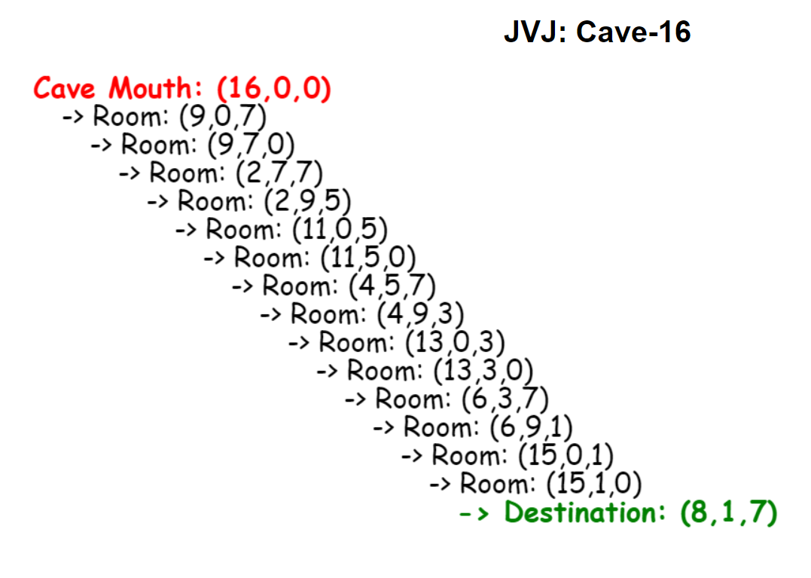

CPSC 335-04
Project 2: Cave Explorer
Team: JVJ = Jalen Jackson, Victoria Tran, Justin Castillo

## Intro
This project uses a Breadth-First Search algorithm to find the pathway to a desired destination in a cave. The specific cave used for this project has a mouth at (16,0,0), has limitations (16,7,9) and a destination of (8,1,7).

## Demo

## External Requirements
None

## Setup and Installation:
	-In 335-p2_JVJ folder
	-Open cave.txt and room.txt
	-Go to 'File' -> 'Save as' on both files 
	-Rename files to cave.js and room.js respectively
	-Save
	-Delete both .txt files

## Contents
335-p2_JVJ contains:
* README.md
* 335-JVJ-Standup.docx
* BigO_Analysis.docx
* SampleInvocation.PNG
* room.txt
* cave.txt
* style.css
* index.html

## Features
Demonstrates a Breadth-First Search 

## Bugs
Algorithm design can be improved using a Depth-First Search approach

